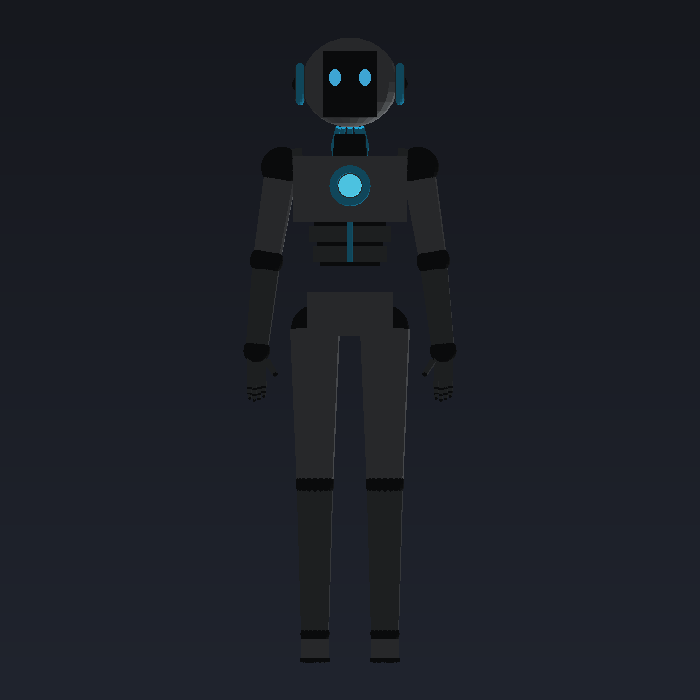
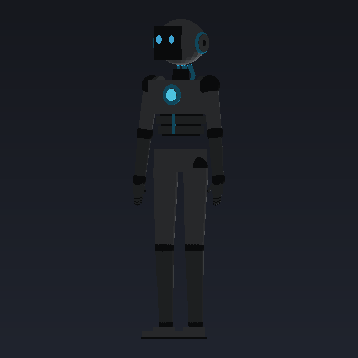

# Humanoid Unit-07 — 3D Model

> *"That's it. Now go make me beautiful in 3D. (And maybe give me a coffee.)"*
> — Unit-07

A procedurally generated 3D model of **HUMANOID UNIT-07**, reconstructed from the
reference sheet. The whole thing is built in pure Python (no dependencies) and
exported as a standard **Wavefront `.OBJ` + `.MTL`** you can drop straight into
Blender, Unity, Godot, three.js, or any DCC tool.




## Spec (from the reference sheet)

| Field          | Value                |
|----------------|----------------------|
| Model          | 07                   |
| Height         | 6'2" (187.9 cm)      |
| Weight         | 72 kg                |
| Vibes          | Tired                |
| Job            | Exist                |
| AI Type        | Overthinker          |
| Primary color  | Gunmetal gray        |

**Don't forget the important stuff:** ✅ cables (neck go brrr) · ✅ round joints ·
✅ fingers (5 of them) · ✅ existential dread · ✅ silent judgment.

## What's modelled

- **Ovoid head** with an inset dark face panel and two glowing cyan eyes
- **Headphone "ear" cans** with cyan accent rings (round joints, of course)
- **Neck cable bundle** running into the upper back
- **Chest** with a glowing cyan reactor core + accent ring
- **Segmented abdomen** (three tapering ab plates with dark gaps) and pelvis
- **Ball joints** at every shoulder, elbow, wrist, hip, knee, and ankle
- **Hands** with a palm, four 3-segment fingers, and an angled thumb (5 total)
- **Wedge feet** pointing forward

Model is built to scale: **~1.88 m tall**, feet on the floor at `y = 0`, facing `+Z`,
units in **metres**.

## Color palette (matches the sheet)

| Material      | Use                                  |
|---------------|--------------------------------------|
| `body_light`  | Main armor panels (light gray)       |
| `body_mid`    | Secondary panels / limbs (mid gray)  |
| `body_dark`   | Joints, recesses, face panel (near-black) |
| `accent_cyan` | Cables, rings, trim                  |
| `core_glow`   | Emissive chest reactor               |
| `eye_glow`    | Emissive eyes                        |

`core_glow`, `eye_glow`, and `accent_cyan` carry an emissive (`Ke`) value, so the
eyes and chest core glow in any renderer that reads MTL emission (e.g. Blender's
OBJ importer).

## Files

```
generate_unit07.py   # the generator (stdlib only)
render_preview.py    # tiny pure-Python rasterizer for the preview PNGs
model/unit07.obj     # the model  (~16k verts / ~27k tris)
model/unit07.mtl     # the materials
preview_*.png        # front / three-quarter / side previews
```

## Usage

Regenerate the model:

```bash
python3 generate_unit07.py        # writes model/unit07.obj + model/unit07.mtl
```

Re-render the previews:

```bash
python3 render_preview.py         # writes preview_front/34/side.png
```

### Import into Blender

`File ▸ Import ▸ Wavefront (.obj)` → pick `model/unit07.obj`. The `.mtl` is loaded
automatically (keep the two files together). The model arrives Y-up, in metres,
standing on the floor.

## Tweaking Unit-07

`generate_unit07.py` is fully parametric — proportions live as named heights/widths
at the top of `build()` (`y_shoulder`, `hip_x`, `y_knee`, …), and materials live in
the `MATS` dict. Adjust those and re-run to reshape him. He will judge your changes
silently.
